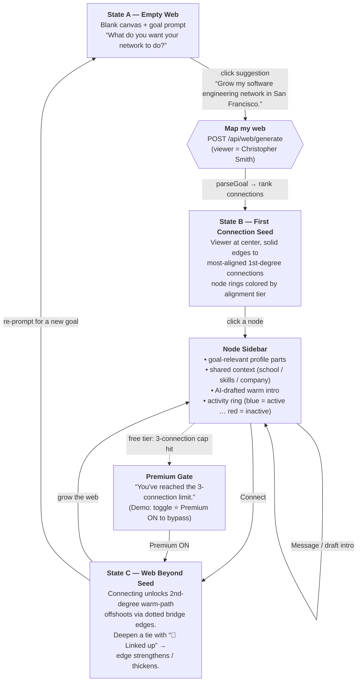

# Demo Guide — LinkedIn Web

> **Mottos:** _Expand your web, reinforce its roots._ · _Keep weaving. Keep connecting._

A presentation-facing walkthrough of the flagship **"Map My Web"** flow (`/web`). Use
this as the script and the slide diagram. For the engineering-level data contract, see
[`user-flows.md`](./user-flows.md).

> **Data note (important):** the running app resolves jobs from the **remote** dataset
> (`https://pit.najera.cc/jobs_data.json`, see `src/lib/data.ts`), not the committed
> `src/data/jobs_data.json`. Every name/role below was verified against what the **live
> server actually returns**, deterministic mode. See §5 before presenting.

---

## 1. The Recommended Demo Goal Prompt

**Click the built-in suggestion (or type it):**

> **`Grow my software engineering network in San Francisco.`**

### Why this prompt

- **It is a built-in suggestion** — one click pre-fills the goal box; no typing on stage.
- **It returns the single cleanest, highest-relevance match in the demo network.** The
  viewer (**Christopher Smith**, Miami FL) has exactly one connection whose **headline
  role and location both match the goal**, and that person surfaces at the top tier with
  no ranking blemish — a tight, credible warm path instead of a noisy web.

### What appears on screen (verified against the live server)

| Degree | Who | Headline (what the node shows) | Tier / score |
|--------|-----|--------------------------------|--------------|
| **1st** | **Kimberly Nguyen** | **Software Engineer · San Francisco, CA** | **moderate (65)** |
| 2nd | Margaret Clark | UX Designer · San Francisco, CA | weak |
| 2nd | + two more offshoots | — | weak |

**The beat:** Kimberly's headline literally reads _"Software Engineer · San Francisco"_ —
exactly the goal. Open her node → the sidebar surfaces shared context + a drafted warm
intro (the "AI networking copilot" moment). Connect → her 2nd-degree offshoots (e.g.
Margaret Clark in SF) unlock as warm-path bridges.

> **Avoid** `I want to break into UX design` for the live demo: it surfaces **Edward
> Martinez at moderate (40)** whose headline reads _"Customer Service Manager"_ (his UX
> Designer role is buried third in his history). It _looks_ like a mismatch on screen and
> undercuts the ranking-specificity story, even though the engine has a valid reason.

---

## 2. User Flow Diagram

---

## 3. Step-by-Step Demo Script

1. **Open `/web`.** The canvas starts in **State A** — blank, with the goal prompt.
   Reference the motto: _"Expand your web, reinforce its roots."_
2. **Click the suggestion** `Grow my software engineering network in San Francisco.` and
   press **Enter** (button reads _"Map my web"_ → _"Mapping…"_).
3. **State B appears.** The viewer sits at the center; **Kimberly Nguyen** surfaces as the
   top **moderate-tier** match — her node headline reads _"Software Engineer · San
   Francisco."_ Point out the **tier-colored rings**: this is the "ranking that respects
   specificity" beat — one strong, on-target path rather than a padded web.
4. **Click Kimberly's node.** The **sidebar** shows the goal-relevant slice of her
   profile, the **shared context**, and a **drafted warm intro** — the "AI networking
   copilot" beat.
5. **Connect.** Connecting unlocks **State C** — **2nd-degree warm-path offshoots** appear
   as dotted bridge edges (e.g. **Margaret Clark**, a UX Designer in SF) — the "who can
   introduce me next" story.
6. **Deepen a tie.** Hit **🔗 Linked up** on a connection to strengthen its edge — the
   line warms/thickens. Reference: _"Keep weaving. Keep connecting."_
7. **(Optional) Hit the free-tier cap.** After 3 connections the **Premium gate** appears;
   toggle **⭐ Premium: ON** to bypass it live and keep growing.
8. **Re-prompt.** Hit reset and enter a different goal to show the web is **goal-scoped** —
   the same network re-organizes around a new objective, looping back to **State A**.

---

## 4. The Three States at a Glance

| State | Name                 | What the user sees                                                        | Transition out                          |
|-------|----------------------|---------------------------------------------------------------------------|-----------------------------------------|
| **A** | Empty Web            | Blank canvas + goal prompt                                                 | Submit goal → **B**                     |
| **B** | First Connection Seed| 1st-degree seed web; click a node for profile + shared context + AI intro | Connect → **C** · Re-prompt → **A**     |
| **C** | Web Beyond Seed      | 2nd-degree warm-path offshoots; edges strengthen with interaction         | Grow / deepen · Re-prompt → **A**       |

---

## 5. Operator Notes (read before presenting)

- **Run the demo server deterministic (LLM off) for reliability.** The bundled
  `OPENROUTER_MODEL` is `openrouter/free`, whose auto-routed free models are rate-limited
  and frequently mis-parse goals live (observed: a UX prompt hallucinating "ML Engineer").
  Every LLM path falls back gracefully to deterministic logic, so the safest demo is to
  run **without** `OPENROUTER_API_KEY` set. The names/scores in §1 are the deterministic
  output. To enable real AI parsing + tailored talking points, point `OPENROUTER_MODEL`
  at a funded paid model and **re-verify the recommended prompt first.**
- **Start it:** `npm run dev` (deterministic — no `.env.local`). The viewer is
  `user_1047` (**Christopher Smith**); the board POSTs this id to `/api/web/generate`.
- **Jobs come from the remote dataset.** `src/lib/data.ts` fetches
  `https://pit.najera.cc/jobs_data.json` at runtime. The committed
  `src/data/jobs_data.json` is a **divergent local snapshot** (the same job ids map to
  different roles) used only by generation scripts/tests — do **not** rely on it to
  predict on-screen results; query the live server instead.
- **Premium is off by default.** The ⭐ Premium toggle is demo-only and bypasses the
  3-connection free-tier cap on demand.
